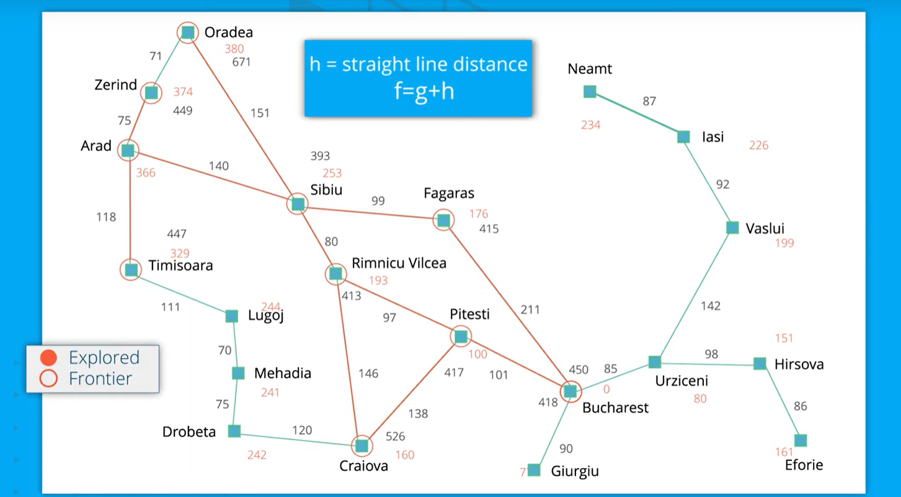

# Fastest Route Planner

## Introduction
This project implements the A* Search Algorithm to solve the fastest route problem, similar to a Google Maps route planner. Learn the full lesson at [Udacity](https://classroom.udacity.com/nanodegrees/nd113/dashboard/overview).

## A* Search Algorithm
A* (A-star) is a graph traversal algorithm used for finding the optimal path from point A to B. It is complete and optimal but has high memory usage (O(bᵈ)). Despite this, it remains a preferred solution in many cases. (Source: Wikipedia)



## Technologies
- Python
- Object-Oriented Design
- Jupyter Notebook
- Data Visualization
- AI & Machine Learning

## Setup
### Prerequisites
- **Jupyter Notebook**: Open-source platform for live code and visualization. 
- **Anaconda Navigator**: For developing data science applications. [Install Anaconda](https://docs.anaconda.com/anaconda/navigator/install/).

### Installation
1. Install [Anaconda Navigator](https://docs.anaconda.com/anaconda/navigator/install/).
2. Try [Jupyter Notebook](https://jupyter.org/try) for code testing.

## Running the Project
1. Download all project files to your local machine.
2. Run the `.ipynb` file in Jupyter Notebook.
3. If you encounter an error with missing modules like `plotly`, run the following command in Anaconda's cmd prompt:
   ```
   pip install plotly
   ```

## Troubleshooting
If you encounter module issues, refer to:
- [GitHub Issue Tracker](https://github.com/plotly/plotly.py/issues/1660)
- [Plotly Troubleshooting Guide](https://plotly.com/python/troubleshooting/)